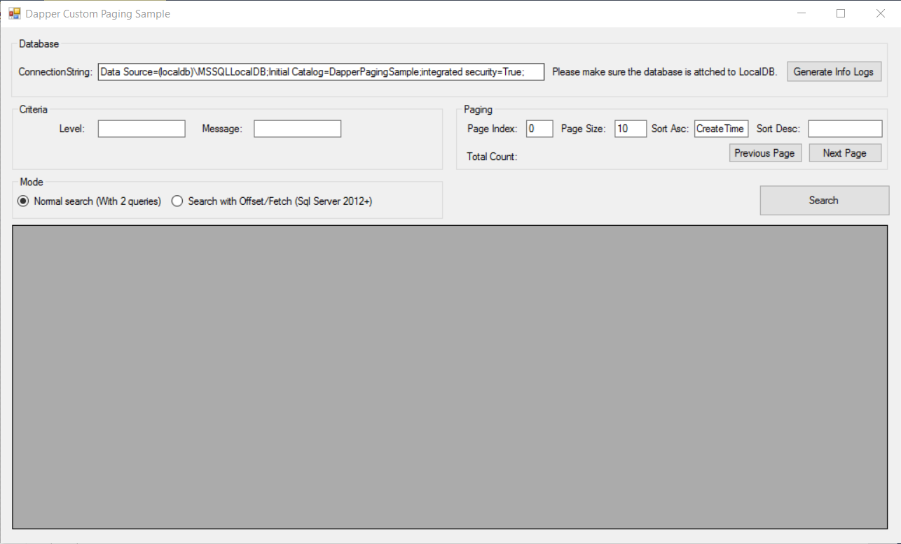

Dapper Custom Pagination Sample
========================================
# Introduction

Sample for custom pagination using Dapper. Supporting sorting + criteria + pagination.

# Usage

* Unzip `Database\Database.7z`, attach to LocalDB, or restore to your favoriate Sql Server instance and change the connection string in App.Config.
* Open solution and run the application.


# Caller sample:
```csharp
 Tuple<IEnumerable<Log>, int> Find(LogSearchCriteria criteria
            , int pageIndex
            , int pageSize
            , List<SortDescriptor> sortings);
```

# Two Approaches

Since it is a custom paging, you need to get the current page records as well as the total record count. After SQL Server 2012, you can use Fetch/Offset statement to do it in a single query. Prior to SQL Server 2012, you need two queries to achieve this. So in my example, I demonstrate the both approach.

You can check the Fetch/Offset sample in Repository\LogRepository.cs `FindWithOffsetFetch`. Another one is also in the same class the method name is `Find`.

# Supports Table Join

In the examples, you can find I used some inner join to demostrate to get some entity from multiple table from database.

# Sample UI to Test

After preparing the database, you can directly compile and run the sample application.


